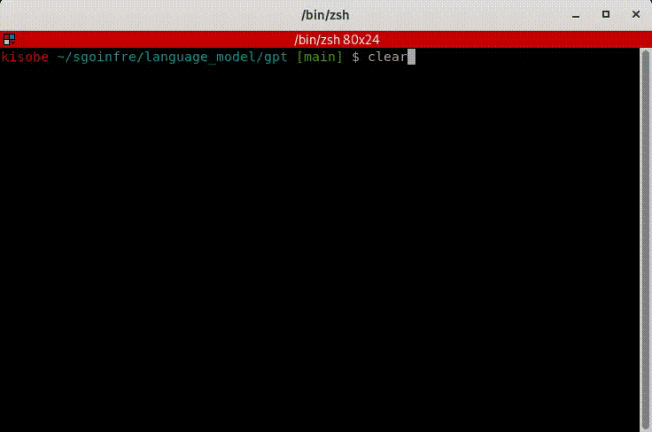

# GPT

an implementation of GPT(Generatively Pretrained Transformer).<br />
see https://arxiv.org/pdf/1706.03762.

## structure

this implementation is inspired by the structure below.


## input
Training on Shakespeare's works.
```
kisobe ~/language_model/gpt [main] $ cat input.txt | head -n 50
First Citizen:
Before we proceed any further, hear me speak.

All:
Speak, speak.

First Citizen:
You are all resolved rather to die than to famish?

All:
Resolved. resolved.

First Citizen:
First, you know Caius Marcius is chief enemy to the people.

All:
We know't, we know't.

First Citizen:
Let us kill him, and we'll have corn at our own price.
Is't a verdict?

All:
No more talking on't; let it be done: away, away!

Second Citizen:
One word, good citizens.
...
```

## output
generate Shakespeare like sentences.

