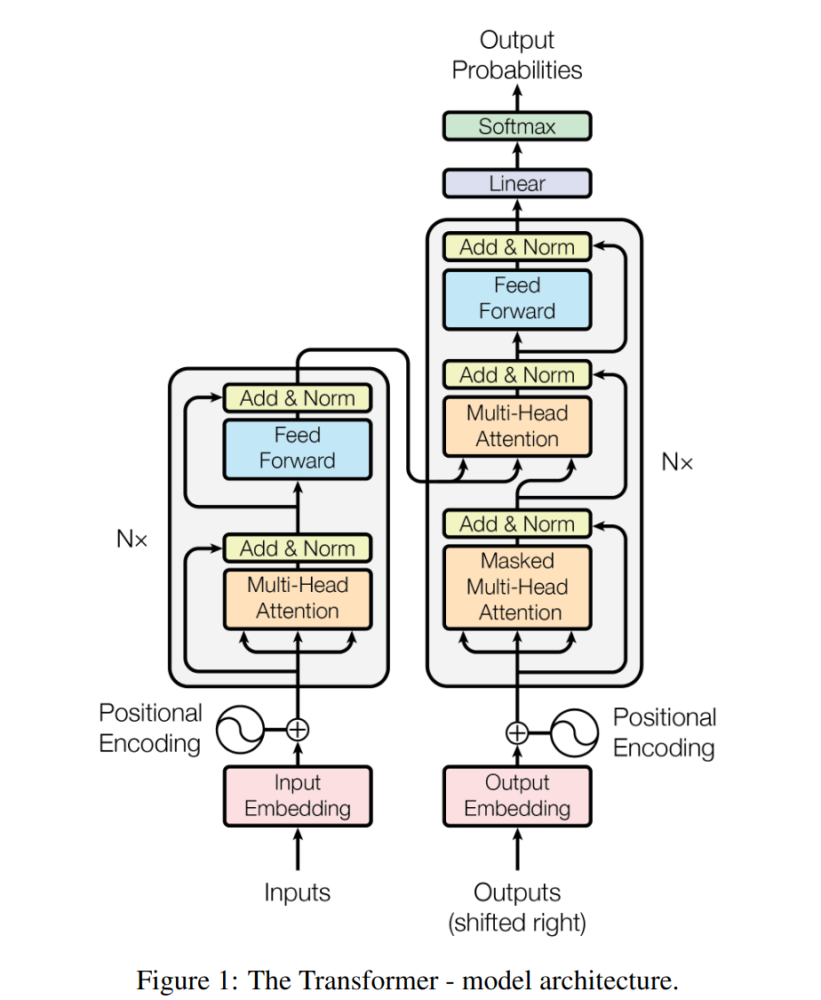

# GPT

an implementation of GPT(Generatively Pretrained Transformer).<br />
see https://arxiv.org/pdf/1706.03762.

## structure

this implementation is inspired by the structure below.



```bash
train loss: 4.501441478729248, validation loss: 4.506412982940674
train loss: 2.072793483734131, validation loss: 2.0847206115722656
train loss: 0.7938932776451111, validation loss: 0.8250218033790588
train loss: 0.37538090348243713, validation loss: 0.4021591544151306
train loss: 0.22472631931304932, validation loss: 0.2418646365404129
train loss: 0.15496926009655, validation loss: 0.17276109755039215
train loss: 0.11815554648637772, validation loss: 0.13013046979904175
train loss: 0.09685444831848145, validation loss: 0.10738019645214081
train loss: 0.0865916833281517, validation loss: 0.09542243927717209
train loss: 0.0779452919960022, validation loss: 0.0854780375957489
```

```bash
# generated texts

Wh fon ffooooooI eeeel i eeeie!
EEerig:
Po, fereis bure onynlero, mot m os chavallss got thaus e es? wE po Fipingenese elhedde
 o icol ponyon, ounl' ele mislnemle
Tha t beem yads'rl? tee hyot u in siceds IZ d -havny tto'd Gea se hul,
Dhiineis ixenco
urnssunerdserp
RYore cy soro ghishlt ha'd
Lhe lild Shissg apinouen ol no
tw cee bk seises incud ipbe nog uil ipildrys Gaogasens rere thwh im.
Hdl GOHaveve pe'dtan bosthos omolm a lleambes;
y wele
w ne halls teme trrensesmokrm, colal,
utht de'Th gis e 'ke my meacry hey mn isiif ivlwis pe-tos nthi lty couctntheare counye pysmoeh ves u ligerpoo.
F re nol mns ee mav ims lit th as
bot, bero! y by
ererou, xl anl tmedrde; oo rorme, nomer tual leve! ear om wn mo is athis -vene
kany got sinen t a coxus, nu.
I tA thatThi is ar? thy corbe fa' betaur g ut ehauprony;- Hamy inecef'shingeh ind cok, why, po'nt e an, I ryob uraier o htr somed udines ht utizere meromak:
TAFr swad;ofouy
 e ik n bor mail belfakef,
q hron, IZ:
Mon ume k some;-us cuda mlys jI wa
```
