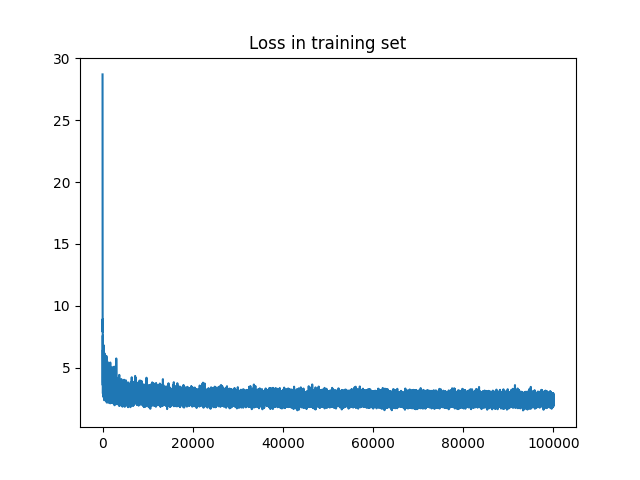

## N-gram character-level language model

implement language model that predict a character from a sequence of N characters.



```bash
training--------------------------------------------------
loss while training: 2.4738337993621826
evaluation--------------------------------------------------
loss while evaluation: 2.884422540664673

thaaliya.
eveegh.
lasaskh.
chen.
sen.
naloya.
bleoa.
kenna.
kany.
catlyn.
```
