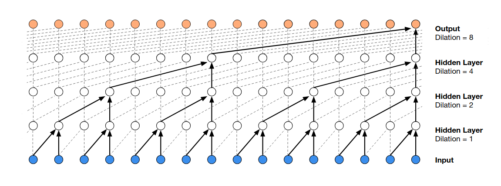
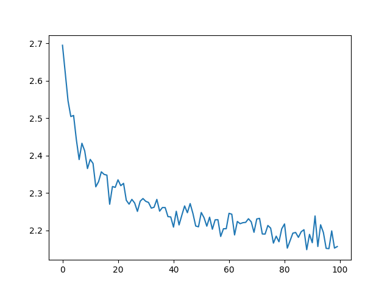

# WaveNet

an implementation of [WaveNet](https://arxiv.org/pdf/1609.03499) like neural network.


* tree like structure


## we can see some improvement of the parameters.


```bash
train_loss: 2.1532058715820312
val_loss: 2.168013095855713

jawn.
brizan.
leonnommk.
skamie.
calmarin.
mikko.
rhonen.
jano.
moiar.
anna.
```
